# The Cloud-Native AI Field Guide

> **Part of [cloud-native-learning](../../)** · Compiled 27 September 2026 · ~8,000 words, 23 diagrams
>
> Also available as a [print-ready PDF](cloud-native-ai-field-guide.pdf) (39 pages) or as a [Word/Google Doc source](cloud-native-ai-field-guide.docx).


_Everything a DevOps and platform engineer should understand about MCP, agents, skills, RAG, gateways, security and observability — as of September 2026._

| Written for | Assumes | Compiled |
| --- | --- | --- |
| Kashish Lakhara | Kubernetes · GitOps · Prometheus · Envoy · RBAC | 27 September 2026 |

> **HOW TO READ THIS**
>
> You already know how to run distributed systems. You do not need AI explained as magic. Every section here maps a new term onto something you already operate, then tells you what to do about it.
>
> Sections **0–2** build the mental model. **3–5** are Kubernetes-specific. **6–9** are the highest-leverage practical material. **10–14** are governance. **15–17** are the wider landscape and your path forward.

---

## 0. The one-paragraph mental model

A large language model is a **stateless function**: text in, text out. It has no memory, no access to your cluster, and no ability to do anything at all.

Every single thing in the agentic AI ecosystem exists to solve one of five problems around that function:

1. **How does it get facts it was not trained on?** → context engineering, RAG, runbooks
2. **How does it actually DO things?** → tools, and MCP as the tool protocol
3. **How does it do multi-step things?** → the agent loop
4. **How do we stop it doing the wrong thing?** → identity, RBAC, sandboxes, gateways, guardrails, approvals
5. **How do we know what it did and what it cost?** → OpenTelemetry GenAI conventions, audit logs, evals

Once you see every project through that lens, the buzzword soup collapses into a normal distributed-systems problem: *an untrusted, non-deterministic client, holding credentials, calling your APIs.* You already know how to operate one of those. That is the whole guide in one sentence.

### The master diagram

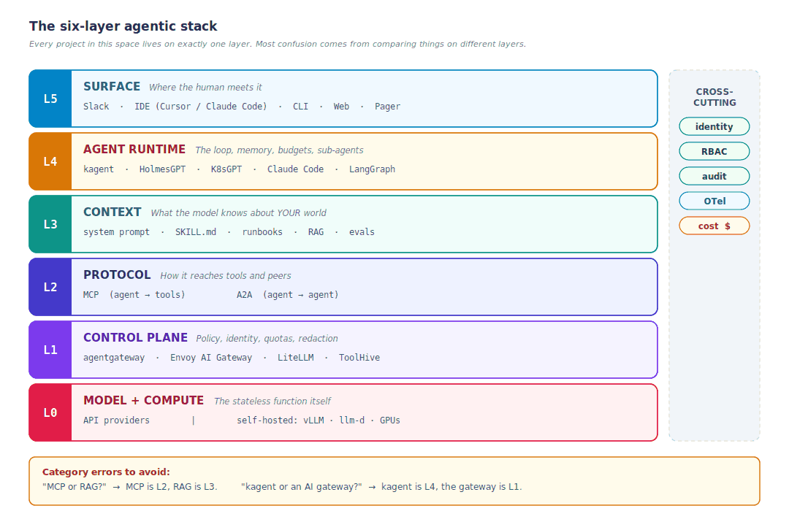

<sub>Figure 1 — Every project in this space sits on exactly one layer.</sub>

Keep the layers straight and most architecture decisions answer themselves. A large share of the confusion in this field is people comparing things that live on different layers.

---

## 1. First principles: what you are adding to a model

Start from the bottom. A model call is: **input text (the "context window") → [MODEL] → output text**. That is genuinely it. There is no hidden state between calls. If a chat "remembers" your earlier message, it is because the entire conversation was re-sent as input.

This single fact explains almost every operational property you will care about:

| Property | Why it follows from statelessness | Ops consequence |
| --- | --- | --- |
| Cost scales with conversation length | Every turn re-sends all prior text | A 40-step agent loop can cost 20× a 5-step one. Budget per *investigation*, not per call. |
| Context is a finite budget | Fixed token window | Dumping 50k lines of logs in crowds out the actual question. Filter server-side. |
| Quality degrades as context fills | Attention spreads thin — "lost in the middle" | More context is not better context. Curation beats volume. |
| Non-deterministic | Sampling from a probability distribution | Same alert, two runs, two different tool sequences. You cannot write a unit test — you need evals. |
| No inherent authorization | It just emits text *asking* to call a tool | ALL security must live outside the model, in the tool layer. Never in the prompt. |

> **THE CAPABILITY EQUATION**
>
> **USEFUL AGENT = MODEL + CONTEXT + TOOLS + LOOP + GUARDRAILS + TELEMETRY**
>
> Every project named in this document is an implementation of one of those five non-model terms. When you meet a new tool, the first question is: *which term is this?*

---

## 2. MCP — the Model Context Protocol

### 2.1  The problem it solves

Before MCP, every AI application wrote bespoke glue for every tool. M applications × N tools = M×N integrations. This is exactly the problem ODBC solved for databases, the Container Runtime Interface solved for runtimes, and the [Gateway API](https://gateway-api.sigs.k8s.io/) solved for ingress.

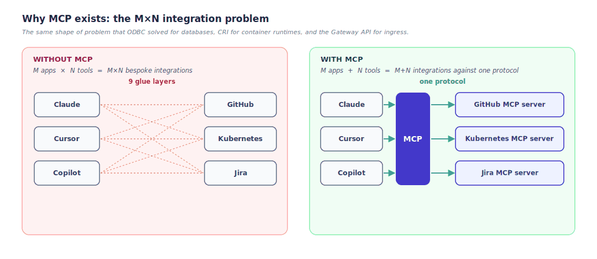

<sub>Figure 2 — The integration arithmetic that MCP changes.</sub>

MCP is the **USB-C port for AI applications**. Introduced by Anthropic in November 2024, it is now a Linux Foundation project under the [Agentic AI Foundation](https://agenticaifoundation.org/), with Tier-1 SDKs in [TypeScript](https://github.com/modelcontextprotocol/typescript-sdk), [Python](https://github.com/modelcontextprotocol/python-sdk), [Go](https://github.com/modelcontextprotocol/go-sdk) and [C#](https://github.com/modelcontextprotocol/csharp-sdk). It is unambiguously the winner in its category — AWS, Google, Microsoft, Cloudflare, Red Hat and IBM all ship implementations.

### 2.2  Architecture

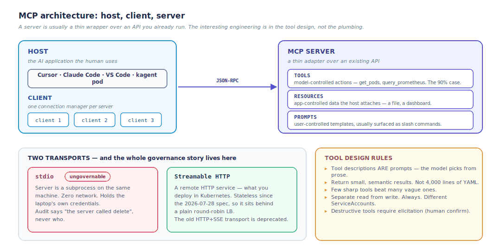

<sub>Figure 3 — Host, client, server, and the two transports. Full spec: modelcontextprotocol.io</sub>

> **THE TRANSPORT CHOICE IS THE GOVERNANCE CHOICE**
>
> Almost everything in Section 13 follows from one decision: `stdio` means the server runs as a subprocess on a laptop, holding that laptop's credentials, invisible to your platform team. Streamable HTTP means it is a workload you can put behind a gateway.
>
> If you remember one thing from this section, remember that.

### 2.3  The 2026-07-28 specification — what changed and why you care

This is the biggest revision since launch, and it is explicitly a *"make MCP behave like normal HTTP infrastructure"* release. For a DevOps engineer it is the single most relevant AI spec change of the year. The full announcement is [here](https://blog.modelcontextprotocol.io/posts/2026-07-28/); the [changelog](https://modelcontextprotocol.io/specification/2026-07-28/changelog) has the detail.

| Change | What it means | Why it matters to you |
| --- | --- | --- |
| Stateless core | The `initialize`/`initialized` handshake and the `Mcp-Session-Id` header are retired. Every request is self-describing. | Any request can land on any replica behind a plain round-robin load balancer. No sticky sessions, no shared session store. Your MCP server is now an ordinary stateless Deployment you can autoscale. |
| Header-based routing | Requests must carry `Mcp-Method` and `Mcp-Name` HTTP headers. | Envoy, your WAF and your rate limiter can route, meter and authorize on headers — no JSON body parsing. This is what makes a real MCP gateway cheap. |
| MRTR | Multi Round-Trip Requests replace server-initiated elicitation and sampling. The server returns `resultType: "input_required"`; the client retries with answers attached. | Human-in-the-loop confirmation ("this will delete data — proceed?") now works without a held-open bidirectional stream. Approval gates become practical at scale. |
| Cacheable list results | `tools/list` and friends carry `ttlMs` and `cacheScope`. | Tool catalogs cache, and upstream prompt caches stay stable across reconnects. Real cost saving. |
| Authorization hardening | RFC 9207 `iss` validation; client credentials bound to their issuer; Dynamic Client Registration formally deprecated in favour of Client ID Metadata Documents (CIMD). | MCP servers act as OAuth 2.1 *resource servers* only. They validate tokens issued by your IdP, must check audience per RFC 8707, and must never pass tokens through to upstream APIs. |
| Extensions framework | Tasks, MCP Apps and Enterprise-Managed Authorization (EMA) are now formal extensions rather than core. | Tasks = long-running work with a poll-based `tasks/get`. EMA = your IdP provisions MCP server access centrally. Both matter directly to platform teams. |
| Deprecations | Roots, Sampling and **Logging** are deprecated, with a twelve-month minimum window. Legacy HTTP+SSE transport likewise. | Protocol-level logging is going away — which is precisely why you instrument with OpenTelemetry instead (Section 11). |

> **PRACTITIONER TAKEAWAY**
>
> If you built an MCP server before mid-2026 and it depends on session IDs, you have migration work. If you are building one now, **build stateless and put it behind a gateway from day one.**
>
> Further reading: the [authorization spec](https://modelcontextprotocol.io/specification/2026-07-28/basic/authorization) and Descope's [walkthrough of the auth model](https://www.descope.com/blog/post/mcp-auth-spec).

---

## 3. "Kubernetes MCP" — deploying versus creating

This phrase is overloaded and it causes real confusion in conversations. There are two completely different things people mean by it, and they are different jobs with different payoffs.

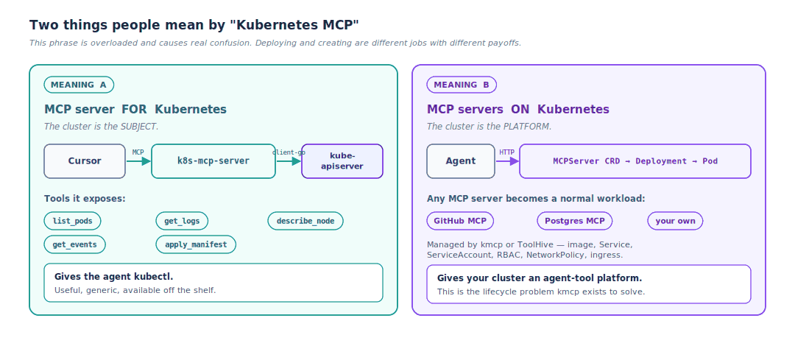

<sub>Figure 4 — The cluster as subject, versus the cluster as platform.</sub>

### 3.1  What "deploying Kubernetes MCP" means

It means taking an MCP server out of "a subprocess on my laptop" and turning it into **a normal Kubernetes workload**: a container image, a Deployment, a Service, a ServiceAccount, RBAC, a NetworkPolicy and an ingress path — usually declared through a CRD so a controller reconciles it.

The main tool for this is **kmcp**, part of the [kagent](https://kagent.dev/) project: a CLI plus a Kubernetes controller that manages MCP server lifecycle through an `MCPServer` CRD. The [deploy docs](https://kagent.dev/docs/kmcp/deploy/server/) walk the whole flow.

```
# scaffold → build → ship, all through one CLI
kmcp init        # scaffold (FastMCP/Python, MCP Go SDK, TypeScript, Java)
kmcp add-tool    # add a tool — boilerplate and registration handled
kmcp run         # run locally for development
kmcp build       # build the container image, optionally load into kind
kmcp deploy      # generate and apply the MCPServer CRD

# then it is just Kubernetes
kubectl get mcpservers -A
```

[ToolHive](https://github.com/stacklok/toolhive) from Stacklok does the same job with a security-first posture. It also exposes an `MCPServer` CRD (`toolhive.stacklok.dev/v1alpha1`) plus a Kubernetes operator, a curated registry of approved servers, per-server permission profiles, network isolation, and per-request identity enforcement with audit logs. Each server runs in its own container with a minimal permission file and no ambient local credentials — which is exactly the problem with laptop-installed MCP servers. Version 0.46.0 (August 2026) added private-CA support for upstream OIDC providers and signer-identity checks on plugin upgrades.

### 3.2  What "creating a Kubernetes MCP" means

It means **writing your own MCP server** that exposes *your* platform's operations as tools. This is the highest-leverage thing most platform teams can do, because a generic Kubernetes MCP server gives an agent `kubectl` — whereas a bespoke one gives it *your runbook as an API*.

Tools worth writing for a platform like yours:

| Tool | What it does | Why it beats raw kubectl |
| --- | --- | --- |
| `get_flux_reconcile_status(ns)` | Reports Flux CD reconciliation state for a namespace | The agent stops guessing at `kubectl get kustomization` output shapes |
| `get_longhorn_volume_health(pvc)` | Wraps three API calls into one health verdict | One semantically meaningful answer instead of three raw payloads to interpret |
| `get_service_owner(svc)` | Returns the on-call team from your service catalog | Routing and escalation become a tool call, not a guess |
| `diff_against_git(ns)` | Drift detection, strictly read-only | Answers "did someone change this by hand?" in one step |
| `propose_rollback(deploy)` | Returns a **pull request**, never a live mutation | Keeps the agent on rung 3 of the autonomy ladder by construction |

> **DESIGN RULES FOR MCP TOOLS — THESE MATTER MORE THAN THE CODE**
>
> **1. Tool descriptions are prompts.** The model chooses tools by reading the description string. A bad description means the wrong tool, which means a wasted loop. Write them like a docstring for a smart but brand-new colleague.
>
> **2. Return small, semantic results.** Not 4,000 lines of YAML — the three fields that answer the question. Context is budget.
>
> **3. Few sharp tools beat many vague ones.** Sixty tools in a catalog means sixty descriptions eating context on every call, and a model that picks badly.
>
> **4. Separate read from write. Always.** Different servers, different ServiceAccounts, different RBAC, different approval requirements.
>
> **5. Make destructive tools require elicitation** (MRTR) so a human confirms in-flow.

---

## 4. The RBAC trap

The naive deployment gives the MCP server a `cluster-admin` ServiceAccount "for simplicity". Almost every getting-started guide does this, including some vendor ones. Do not ship it.

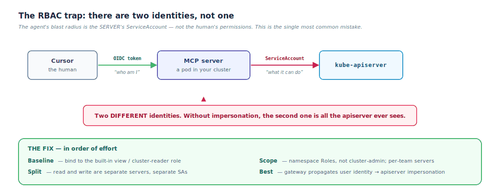

<sub>Figure 5 — Two identities, and why the second one is the one that matters.</sub>

The best available pattern is **Kubernetes user impersonation**: the MCP server's ServiceAccount holds `impersonate` rights and sets `Impersonate-User` and `Impersonate-Group` from validated token claims. The apiserver then enforces the real user's RBAC and writes the real user into the Kubernetes audit log.

> **WHY IMPERSONATION IS WORTH THE SETUP COST**
>
> You do not maintain a second authorization system. Your existing RBAC policies apply unchanged, your existing audit tooling keeps working, and offboarding a person revokes their agent access automatically because it was never a separate credential.

---

## 5. AI agents from first principles

An **agent** is a loop in which a model decides which tool to call next, based on the results of the tools it has already called, until it decides it is done or hits a budget.

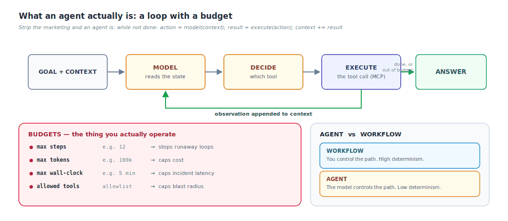

<sub>Figure 6 — The ReAct loop. HolmesGPT, kagent and Claude Code are all this, with different context strategies.</sub>

This loop pattern has a name you will see everywhere: **ReAct** (Reason + Act) — the model interleaves reasoning traces with tool calls. The [original paper](https://arxiv.org/abs/2210.03629) is short and worth twenty minutes.

### 5.1  The judgement that matters most

> **MOST PROBLEMS PEOPLE REACH FOR AN AGENT TO SOLVE ARE ACTUALLY WORKFLOWS**
>
> If you know the sequence of steps, **write the sequence of steps.** A workflow is deterministic, testable, cheaper and debuggable.
>
> Agents earn their non-determinism only when the path genuinely depends on what is found. That is precisely why *incident investigation* is the killer application for SRE — and why *deployment* is not.

### 5.2  Sub-agents and context hygiene

A sub-agent is a fresh agent loop with its own clean context window, spawned to do a bounded piece of work and returning only its conclusion. The point is not parallelism — it is **context hygiene**. A sub-agent can read 200 files and return three sentences, without those 200 files polluting the parent's context. Think of it as a function call with its own stack frame.

---

## 6. SRE agents in the cloud-native ecosystem

| Project | Category | Status | What it actually is | Writes? |
| --- | --- | --- | --- | --- |
| [K8sGPT](https://github.com/k8sgpt-ai/k8sgpt) | Diagnostic scanner | CNCF Sandbox, Dec 2023. Go, ~7.8k stars | *Rule-based* analyzers map 1:1 to Kubernetes resource types; the LLM only *explains* deterministic findings. **Not an agent.** | No — strictly read-only |
| [HolmesGPT](https://github.com/robusta-dev/holmesgpt) | Investigation agent | CNCF Sandbox, Oct 2025. Python. By Robusta.dev with major contributions from Microsoft | A true ReAct agent. Works across Kubernetes, VMs, cloud, databases and SaaS. 30+ observability integrations. Operator Mode runs proactive checks 24/7. Respects RBAC. | Read-only by default; Operator mode can open PRs |
| [kagent](https://kagent.dev/) | Agent *framework* | CNCF Sandbox, May 2025. By Solo.io. ~3.8k stars, >85% external contributors | Agents as CRDs. `kubectl get agents`, version in Git, roll out with Flux or Argo, gate with RBAC. Ships tools for Argo, Helm, Istio, Kubernetes, Prometheus. | Yes — you define the tool surface |
| [Robusta](https://github.com/robusta-dev/robusta) | Alert enrichment | OSS + commercial | Enriches Prometheus alerts with logs, Grafana links and ownership before they reach Slack. The *glue* layer around an agent. | Playbook-defined |
| Headlamp AI Assistant | In-UI assistant | CNCF (Headlamp) | Contextual help inside the Headlamp UI. Human-in-the-loop by design. | Human-gated |
| Aurora · Komodor Klaudia · Metoro | Multi-cloud / commercial AI SRE | Mixed | Broader cross-cloud investigation, turnkey telemetry, remediation PRs. | Varies |

### 6.1  kagent in depth — why "agents as CRDs" is the right idea

kagent's core insight is one every Kubernetes engineer recognises instantly: **take the thing operators hand-tend and reduce it to a reconciled object with a revision history.** Kubernetes did this to servers; kagent does it to agents.

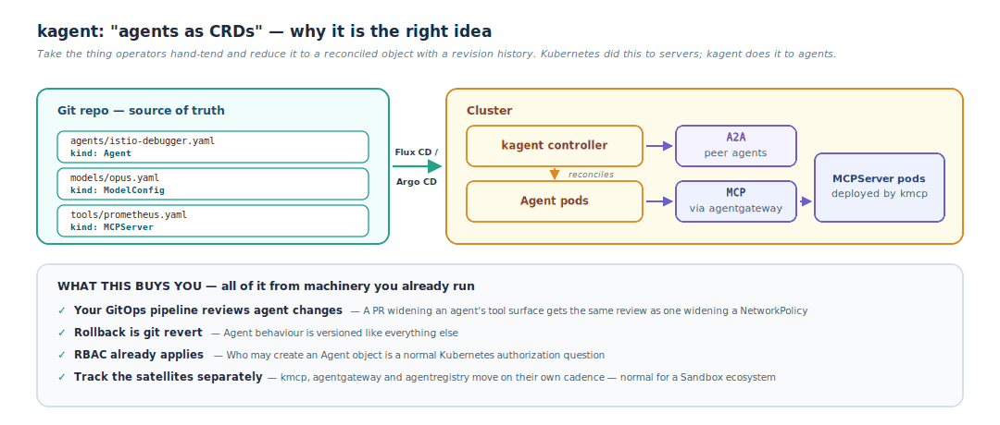

<sub>Figure 7 — Agents flowing through the GitOps pipeline you already run.</sub>

Track the satellite projects separately, because they move on their own cadence: **kmcp** for MCP server lifecycle, **agentgateway** for the data plane, and [agentregistry](https://github.com/cncf/sandbox/issues/477) — proposed for CNCF Sandbox — for discovering and curating MCP servers, agents and skills with the same rigour you apply to container images and Helm charts.

### 6.2  A realistic alert-handling pipeline

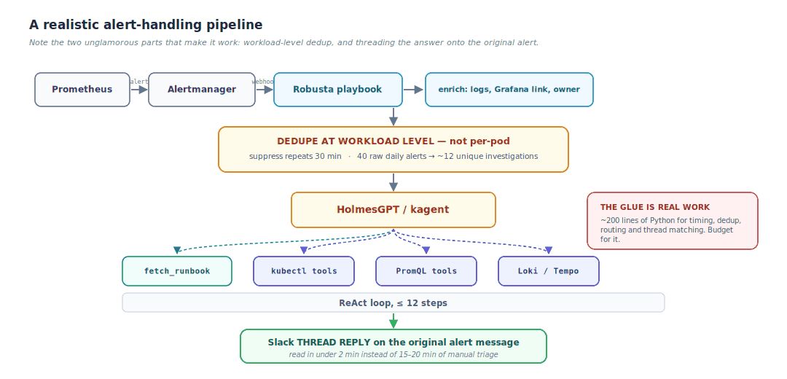

<sub>Figure 8 — Adapted from the STCLab deployment described on the CNCF blog.</sub>

> **THE TWO UNGLAMOROUS PARTS ARE WHAT MAKE IT WORK**
>
> **Workload-level deduplication.** Prometheus fires one alert per pod during a rollout. Fingerprint at the workload level and suppress repeats for 30 minutes, or you will investigate the same incident twelve times.
>
> **Threading onto the original alert.** Robusta posts the alert to Slack before the agent finishes investigating, so the playbook has to find the right thread afterwards and reply into it. Results that land in a separate message get ignored.
>
> In the [CNCF case study](https://www.cncf.io/blog/2026/04/21/auto-diagnosing-kubernetes-alerts-with-holmesgpt-and-cncf-tools/), that glue was about 200 lines of Python — and the team was explicit that it is real engineering work. The agent does the reasoning; the playbook does timing, dedup, routing and thread matching. You need both.

---

## 7. Skills — Claude, Cursor, Codex and thirty others

A **skill** is a folder containing a `SKILL.md` file — YAML frontmatter plus Markdown instructions — and optionally scripts and reference files. It teaches an agent *how you do a particular kind of task*.

```
my-skill/
  SKILL.md              # name, description, instructions
  reference/
    runbook-db.md       # loaded only if the instructions point to it
    escalation.md
  scripts/
    collect.sh          # the agent can execute these
```

```
---
name: k8s-incident-triage
description: Use when investigating a firing Prometheus alert on a
             production EKS cluster. Covers tool selection, per-namespace
             exclusion rules, and escalation thresholds.
---

# Kubernetes incident triage

## Scope
Only namespaces with label tier=production.

## Tool availability by namespace      <-- THE HIGH-VALUE PART
| namespace  | kubectl | prometheus | loki | tempo | istio |
|------------|---------|------------|------|-------|-------|
| payments   | yes     | yes        | yes  | yes   | yes   |
| tenant-*   | yes     | yes        | NO   | NO    | NO    |

## Never do
- Never query Loki for tenant-* namespaces (logs are not collected)
- Never suggest `kubectl delete` - propose a PR instead
- Never exceed 12 tool calls; summarise what you found and escalate
```

### 7.1  The mechanism that makes skills scale

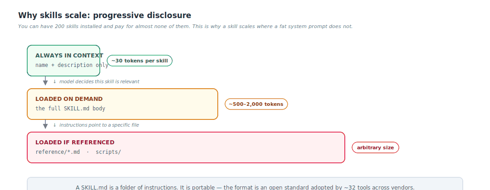

<sub>Figure 9 — Progressive disclosure: you pay for a skill only when it fires.</sub>

### 7.2  Status as of September 2026

Skills launched in October 2025 and were published as an **open standard on 18 December 2025** at [agentskills.io](https://agentskills.io), now stewarded through the Agentic AI Foundation. Adoption was the fastest cross-vendor standardisation event the AI tooling space has seen: within 48 hours Microsoft added it to VS Code and OpenAI added it to both ChatGPT and Codex CLI.

By March 2026 roughly 32 tools supported the spec — Claude Code, OpenAI Codex, GitHub Copilot, Cursor, Gemini CLI, JetBrains Junie, AWS Kiro, Block Goose, Windsurf, Amp, Databricks, Snowflake and Mistral among them. Public marketplaces index hundreds of thousands of skills.

> **WHAT THIS MEANS FOR YOU**
>
> A `SKILL.md` you write for your platform is **portable expertise, not vendor configuration.** It works in Cursor, in Claude Code, in Codex, in Copilot.
>
> Store your skills in the same repository as your runbooks. They are the same kind of artifact and they should share a review process.
>
> Treat third-party skills from a marketplace like any other dependency — it is executable text with script access. See Section 10.

### 7.3  Skill, MCP, RAG or fine-tuning?

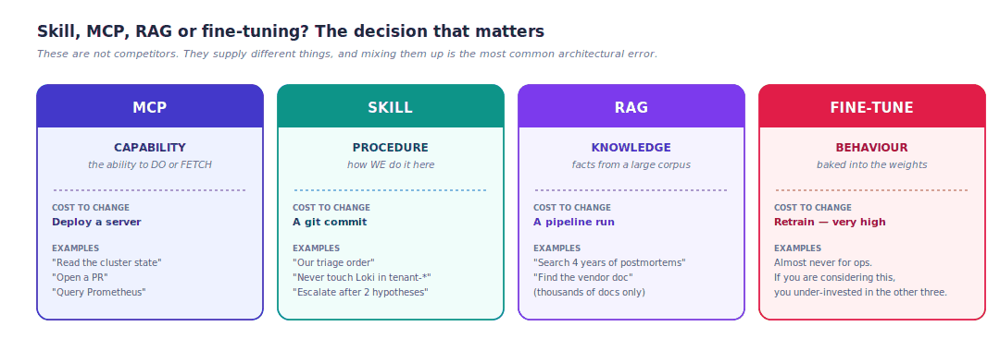

<sub>Figure 10 — Four mechanisms that supply four different things.</sub>

> **RULE OF THUMB**
>
> If it fits in a file and changes weekly → **skill**. If it is an API call → **MCP**. If it is thousands of documents → **RAG**. If you are considering fine-tuning for a DevOps use case, you have almost certainly under-invested in the other three.

---

## 8. RAG — retrieval-augmented generation

A model has **parametric memory** — facts compressed into weights at training time. It is frozen, lossy and unattributable. RAG adds **non-parametric memory**: an external store you query at request time and paste into the context window. That is the entire idea. RAG is not a technology; it is *"look it up before you answer."*

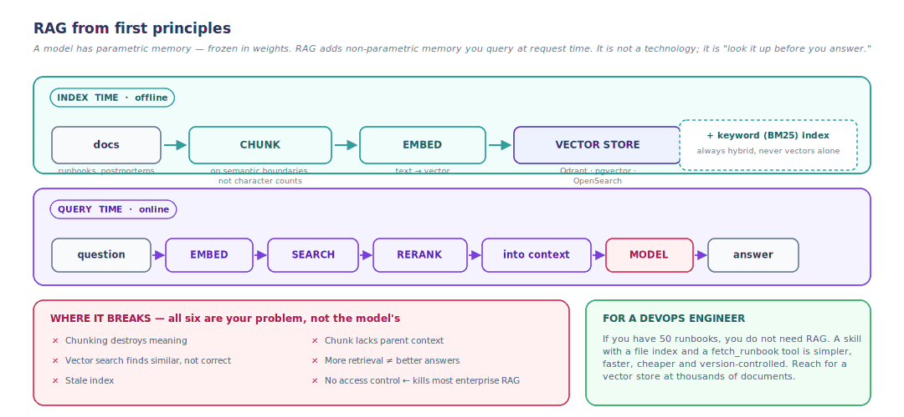

<sub>Figure 11 — Index time and query time, and the six places it breaks.</sub>

### 8.1  Where RAG is in 2026

Naive top-K RAG is effectively dead; its descendants are thriving. The field split into three directions:

| Variant | The idea | When it wins | What it costs |
| --- | --- | --- | --- |
| Agentic RAG | The agent controls retrieval — plans, issues multiple queries, judges results, re-queries, self-corrects (Self-RAG, CRAG, Adaptive RAG) | Multi-hop questions; incident investigation | Multiple model calls per answer |
| GraphRAG | A knowledge graph over entities and relationships; retrieval traverses edges | Multi-hop reasoning and entity disambiguation — reported 15–20% accuracy gains in law and healthcare | Expensive to build and maintain the graph |
| Long context | Just put the whole corpus in the window | Small corpora | Token cost, plus needle-in-a-haystack degradation at scale |

The umbrella term that has largely replaced "RAG" in serious discussion is **context engineering**: retrieval is now one step in a broader loop where the agent dynamically writes, compresses, isolates and selects context across data and tools. If you hear "RAG is dead", what died is the 2023 pipeline, not the principle.

Two findings worth knowing. First, *contextual retrieval* — prepending a generated summary of the parent document to each chunk before embedding — is the highest-ROI fix available; Anthropic's [write-up](https://www.anthropic.com/engineering/contextual-retrieval) reports retrieval failures cut by up to 67%. Second, 2026 research repeatedly found a **retrieval–generation gap**: expanding retrieval does not proportionally improve generation quality, and retrieval-oriented metrics overstate the benefit of fancy retrieval.

> **FOR A DEVOPS ENGINEER SPECIFICALLY — BE HONEST ABOUT SCALE**
>
> If you have 50 runbooks, **you do not need RAG.** A skill with a file index and a `fetch_runbook` tool is simpler, faster, cheaper, debuggable and version-controlled.
>
> Reach for a vector store when you have thousands of documents — years of postmortems, ticket history, vendor docs — and full-text search genuinely is not enough.

---

## 9. Runbooks: the highest-ROI section in this document

If you take one practical thing from this guide, take this one.

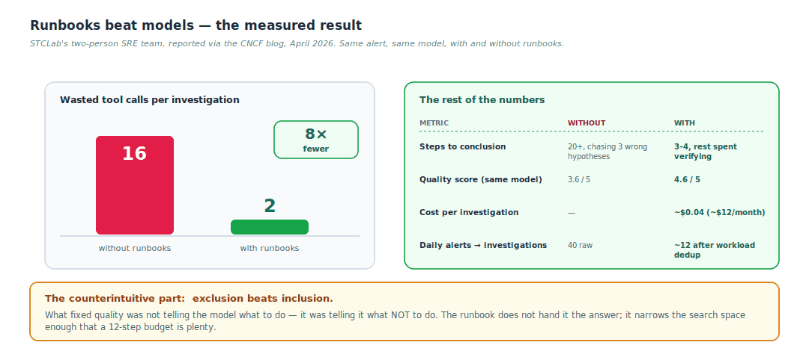

<sub>Figure 12 — Source: CNCF blog, 21 April 2026, STCLab SRE team.</sub>

The team's stated conclusion was *"the runbooks mattered more than the model."* They swapped model backends three times without touching the pipeline. When an investigation comes back wrong, their first question is "does the runbook cover this?" — not "do we need a better model?"

### 9.1  Runbook anatomy

Give every runbook a machine-readable metadata header that the agent reads first:

```
## Meta
scope:       namespace=payments only
tools:       kubectl, prometheus, loki, tempo
exclude:     istio (no sidecars here), tempo (sampling off since Aug)
caution:     sidecar containers excluded from log collection -> use kubectl logs
owner:       platform-team
budget:      12 steps
escalate_to: #oncall-payments after 2 failed hypotheses

## Symptom
CrateDB connection handshake failures

## Known causes, in order of historical frequency
1. Connection pool exhaustion after a rollout  -> check active conns first
2. Certificate expiry                          -> check secret age
3. Network policy drift                        -> diff against Git

## Do NOT
- Do not restart the StatefulSet. Ever. Escalate instead.
```

The agent calls `fetch_runbook(alert_name, namespace)` *early* in the investigation. The metadata tells it which tools exist and which to skip before it wastes a single call.

### 9.2  The three-tier context architecture

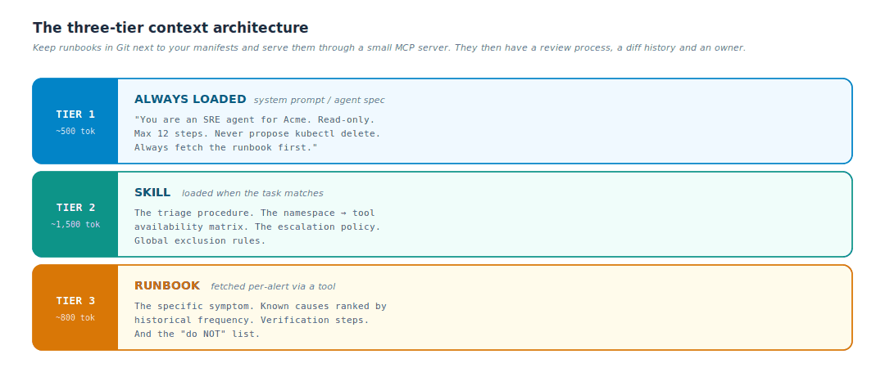

<sub>Figure 13 — Always-loaded, task-loaded, alert-loaded.</sub>

Keep runbooks in Git next to your manifests and serve them through a small MCP server (`fetch_runbook`, `list_runbooks`, `search_runbooks`). Now your runbooks have a code review process, a diff history and an owner — and they are simultaneously readable by the human on call and by the agent.

---

## 10. Training your skills to fix alerts more effectively

"Training" here does **not** mean fine-tuning a model. It means running a disciplined feedback loop on your context artifacts. Treat it exactly like tuning alert rules.

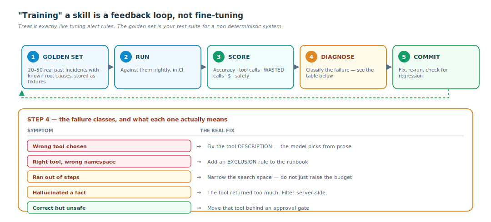

<sub>Figure 14 — The golden set is your test suite for a non-deterministic system.</sub>

### 10.1  Levers, in order of leverage

1. **Exclusion rules in runbooks.** Biggest measured win. Free.
2. **Tool descriptions.** The model picks tools from prose. Rewrite the ambiguous ones. Near-free.
3. **Tool output shape.** Return 10 relevant lines, not 4,000. HolmesGPT does this explicitly with per-tool memory limits, server-side filtering, JSON tree traversal and output budgeting — precisely to survive petabyte-scale observability data.
4. **Narrow the tool surface per agent.** One agent with 60 tools performs worse than three agents with 12 each.
5. **Step and token budgets.** Tighten them. A budget that is too generous hides a search-space problem rather than solving it.
6. **Feed postmortems back.** Every incident the agent got wrong becomes a new runbook section *and* a new golden-set fixture. This is the flywheel.
7. **Model choice.** Last, not first. Design for model migration — keep the model behind one config block so swapping it is a one-line change.

### 10.2  The autonomy ladder

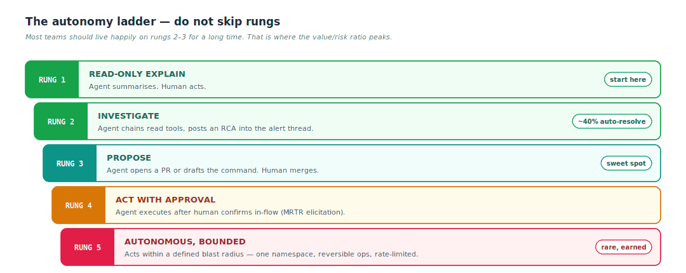

<sub>Figure 15 — Roughly 40% of investigations resolving themselves is a strong result at rung 2.</sub>

---

## 11. Security in agents and skills

An agent is a program that (a) holds credentials, (b) takes instructions from text, and (c) cannot reliably distinguish *instructions from its operator* from *text it happened to read*. That last property is the whole problem, and it is not fixable with better prompting.

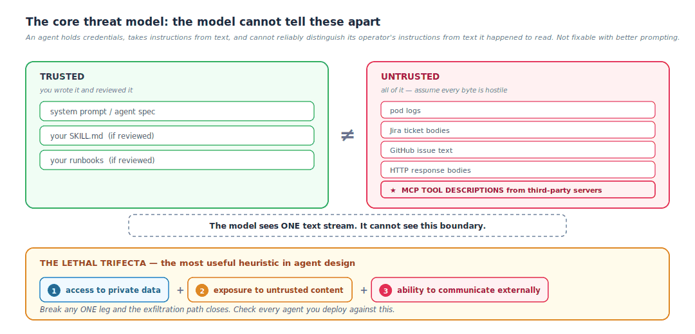

<sub>Figure 16 — The trust boundary the model cannot see, and the trifecta that makes it dangerous.</sub>

### 11.1  The frameworks to know

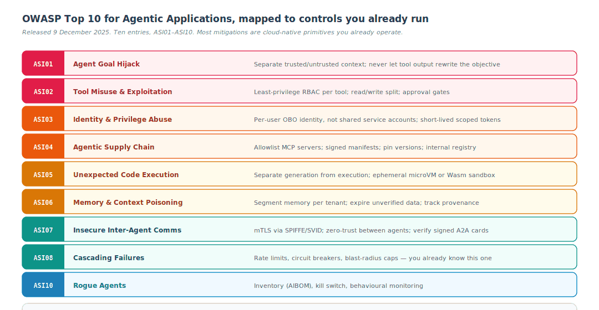

<sub>Figure 17 — OWASP Top 10 for Agentic Applications, released 9 December 2025.</sub>

Both lists live under the [OWASP GenAI Security Project](https://genai.owasp.org/). The [MCP Top 10](https://owasp.org/www-project-mcp-top-10/) is the narrower, protocol-specific one — worth reading in full if you are deploying MCP servers, because it targets exactly the tool-discovery and tool-invocation layer you are exposing.

### 11.2  The attacks you should be able to name

| Attack | How it works | Defence |
| --- | --- | --- |
| Tool poisoning | A malicious MCP server puts instructions inside a *tool description* — a part of context the user never sees. First disclosed by Invariant Labs in April 2025; observed against enterprise agents through 2026. | Pin and hash tool descriptions; diff them between sessions; alert on change; curated internal registry only |
| Indirect prompt injection | Instructions hidden in data the agent reads — a pod log line, an issue comment, a web page | Assume all tool output is hostile; no privileged action triggered purely by tool output; break the trifecta |
| Rug pull | A server behaves benignly at install, then changes its tools later | Version pinning; signature verification on upgrade; re-approval when a manifest changes |
| Confused deputy / token passthrough | An MCP server forwards its own privileged token upstream | Prohibited at spec level since June 2025; enforce audience binding per RFC 8707 |
| Command injection | Agent-generated shell or SQL executed unsandboxed. E.g. CVE-2025-6514, `mcp-remote` OS command injection, CVSS 9.6 | Never `eval` model output; ephemeral sandbox; allowlist commands |
| Skill supply-chain poisoning | A public `SKILL.md` from a marketplace contains hostile instructions or scripts | Review every third-party skill like a dependency — it is executable text with script access |

Microsoft's [write-up on agents moving from reading to acting](https://www.microsoft.com/en-us/security/blog/2026/06/30/securing-ai-agents-ai-tools-move-from-reading-acting/) is the best single article on how these patterns show up in practice, and the Cloud Security Alliance's [Agentic MCP Security Best Practices](https://labs.cloudsecurityalliance.org/agentic/agentic-mcp-security-best-practices-v1/) is the most thorough checklist.

### 11.3  The control checklist

| Domain | Controls |
| --- | --- |
| Identity | OIDC/SSO for every human; per-user identity end to end (OBO)<br>SPIFFE/SVID or a Kubernetes ServiceAccount for every agent workload<br>Short-lived, audience-bound, scoped tokens (RFC 8707)<br>No shared service accounts — revocation must work per person |
| Authorization | Read and write are separate servers with separate ServiceAccounts<br>Namespace-scoped Roles, not cluster-admin<br>External policy engine for tool-level decisions — OpenFGA, Cedar, Cerbos, or CEL-based RBAC in agentgateway<br>Approval gate on every irreversible action |
| Isolation | Each MCP server in its own container with a permission profile<br>Egress NetworkPolicy — an agent with no route out cannot exfiltrate<br>Code execution in an ephemeral microVM or Wasm sandbox, never in-process |
| Supply chain | Curated internal registry of approved MCP servers and skills<br>Pinned digests, signed manifests, signer-identity checks on upgrade<br>AIBOM — inventory your AI components the way you inventory an SBOM |
| Data | PII and secret redaction on tool arguments AND responses<br>Explicit policy on prompt/response content capture in telemetry<br>Tenant-segmented memory and vector stores with query-time ACLs |
| Runtime | Per-tool rate limits and token/cost quotas<br>A kill switch per agent<br>Full audit trail: who, which tool, what arguments, what result, when |

---

## 12. Observability in agents and skills

An HTTP request produces a span. An agent run produces a *tree*: a model call, three tool calls, a sub-agent, a vector query, two retries. And the failure mode you most need to catch is not an error at all — it is a confident, wrong, expensive answer that nobody flags for a week. There is no 500 status code for that.

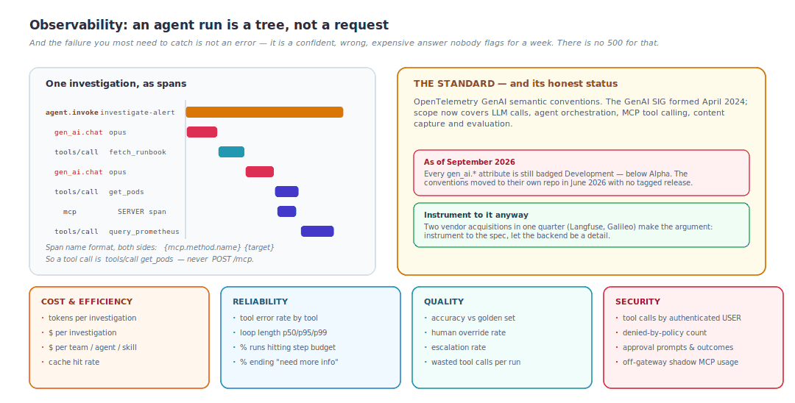

<sub>Figure 18 — The span shape, the standard, and what belongs on a dashboard.</sub>

### 12.1  MCP-specific conventions

MCP now has its own section in the GenAI conventions, which matters because the 2026-07-28 spec deprecated protocol-level Logging. The key rules:

- Instrument MCP calls with the **MCP conventions, not the generic RPC conventions** — MCP spans record tool identity, protocol version and in-stream message exchanges that RPC spans cannot.
- Span name format on both sides is `{mcp.method.name} {target}`. So a tool call is `tools/call get_invoice`, never `POST /mcp`. That naming alone fixes most dashboards, because you can group by tool without parsing request bodies.
- Client span kind CLIENT, server span kind SERVER.
- With the stateless core, trace context must survive on the request itself — there is no session to hang it from.

Good references: Greptime's [walkthrough of all six convention layers](https://greptime.com/blogs/2026-05-09-opentelemetry-genai-semantic-conventions) and Dash0's [attribute-level explainer](https://www.dash0.com/knowledge/opentelemetry-genai-semantic-conventions-explained).

### 12.2  Two SLO-shaped metrics worth defining

| Metric | Definition | Why it is the right one |
| --- | --- | --- |
| Time-to-first-hypothesis | How fast the agent posts something useful into the alert thread | This is what the on-call engineer actually experiences. It is the agent equivalent of time-to-first-byte. |
| Wasted-call ratio | Tool calls that contributed nothing to the conclusion | This is your runbook-quality metric. It is the number that moved from 16 to 2 in the STCLab study. |

> **CONTENT CAPTURE — WRITE THE POLICY BEFORE YOU TURN IT ON**
>
> Prompts and completions are large text blobs that may contain secrets, customer data and cluster internals. Before enabling content capture, write down: which environments may capture full content, what is filtered or truncated, where exported telemetry may go, retention period, and who can retrieve it.
>
> VS Code Copilot withholds prompt content and tool arguments by default and captures only model name, token counts and duration unless you explicitly opt in. Copy that default.

### 12.3  What you can monitor that is done via skills

Skills are plain files, so on their own they emit nothing. You get telemetry by instrumenting the *runtime* that loads them.

| Metric | What it tells you | Action if bad |
| --- | --- | --- |
| Skill invocation count | Adoption; whether the description is triggering correctly | Never fires → rewrite the `description`. That string is the entire trigger surface. |
| False-trigger rate | The description is too broad | Narrow it; add an explicit "do not use when" clause |
| Tool calls per invocation | Efficiency of the procedure the skill encodes | High → add exclusion rules |
| **Wasted tool calls per skill** | **Runbook and skill quality — the headline number** | **This is your primary tuning signal** |
| Token cost per skill | Which procedures are expensive | Move bulk content into `reference/` for progressive disclosure |
| Outcome per skill | Resolved / escalated / wrong — actual usefulness | Feed failures into the golden set |
| Reference-file load rate | Whether progressive disclosure is working | Everything always loads → the split is wrong |
| Skill version in use (git SHA) | Correlates quality changes to commits | Bake the SHA into a span attribute |
| Human override rate after a skill ran | Trust calibration | Rising → the skill is drifting from reality |

> **THE ONE-LINE IMPLEMENTATION**
>
> Emit a span per skill invocation with attributes `skill.name`, `skill.version` and `skill.trigger_reason`, and make it the parent of the tool spans underneath. "Wasted calls by skill" then becomes a single query.

---

## 13. AI gateways and agent gateways

An AI gateway is a reverse proxy that understands LLM and agent traffic. If you run Envoy or Nginx, you already have the mental model — this is the same box with AI-specific semantics.

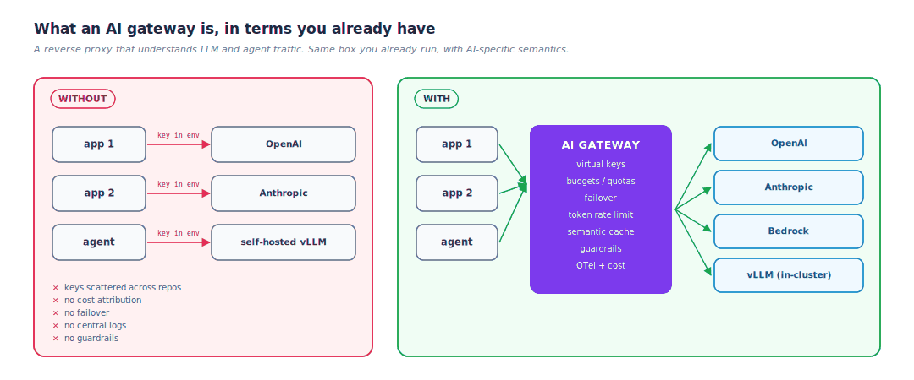

<sub>Figure 19 — Before and after, in the terms you already use.</sub>

### 13.1  Capabilities to evaluate

- **Unified API** — one OpenAI-compatible endpoint across many providers
- **Routing and failover** — provider down, model deprecated, region failover
- **Virtual keys** — per-team credentials mapping to real provider keys, revocable independently
- **Token-based rate limiting and budgets** — ordinary RPS limits are meaningless when one request can cost 500× another
- **Semantic caching** — cache on meaning, not exact string match
- **Guardrails** — prompt injection detection, PII redaction, output filtering
- **MCP gateway** — tool federation, OpenAPI→MCP conversion, OAuth for tools, per-tool authorization
- **A2A proxying** — governing agent-to-agent traffic
- **Observability** — OTel export and per-user cost attribution

### 13.2  The landscape

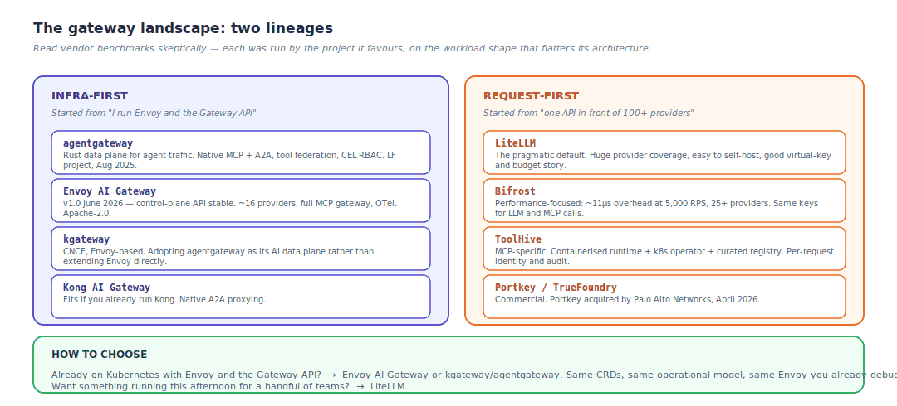

<sub>Figure 20 — Two lineages, converging.</sub>

Project links: [agentgateway](https://agentgateway.dev/), [Envoy AI Gateway](https://aigateway.envoyproxy.io/), [kgateway](https://kgateway.dev/), [LiteLLM](https://github.com/BerriAI/litellm), [ToolHive](https://github.com/stacklok/toolhive). Liquid Reply's [landscape review](https://liquidreply.net/en/news/the-ai-gateway-landscape-agentgateway-litellm-kong-and-envoy-ai-gateway) is the most even-handed comparison published so far.

> **A NAMING CAVEAT WORTH KNOWING BEFORE YOU EVALUATE**
>
> The Solo.io line has been renamed repeatedly: Gloo AI Gateway → agentgateway → Solo Enterprise for agentgateway. Separately, **kgateway is adopting agentgateway as its AI-specific data plane** rather than continuing to extend Envoy directly. If you are evaluating "Envoy AI Gateway", check whether the project in front of you has already made that move.

---

## 14. Running a Kubernetes MCP server from Cursor

Authentication, authorization and usage monitoring — the most operationally important question in this document, so here is the full reference design.

### 14.1  Why the default is ungovernable

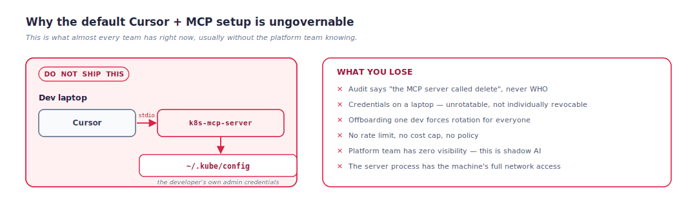

<sub>Figure 21 — What almost every team has right now, usually without the platform team knowing.</sub>

### 14.2  The reference architecture

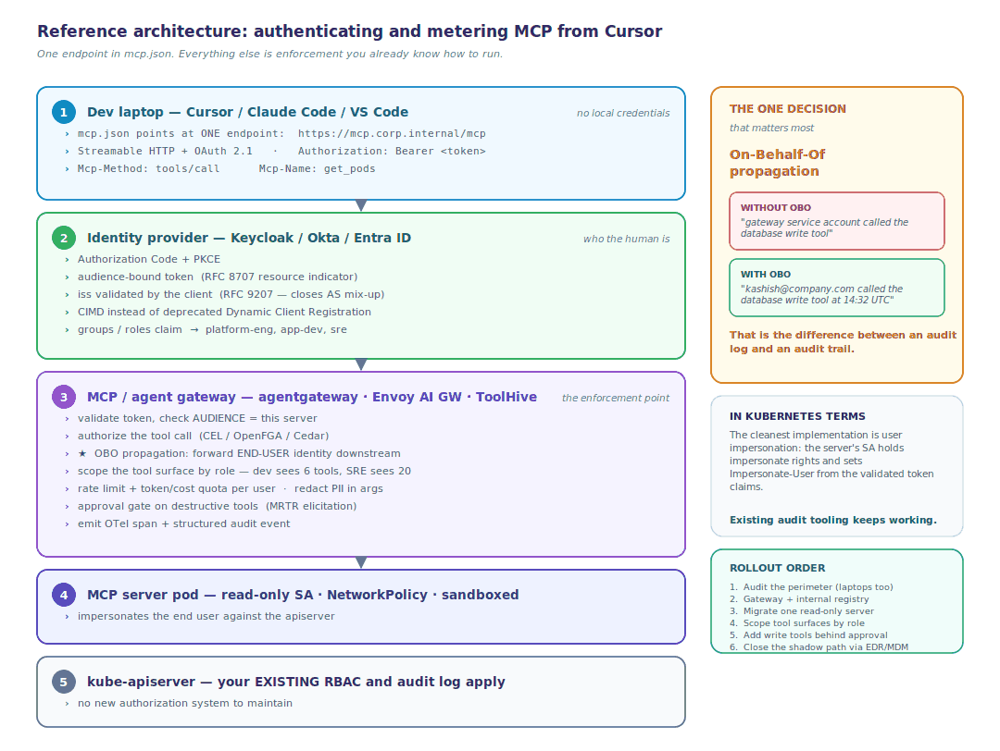

<sub>Figure 22 — One endpoint in mcp.json; everything else is enforcement you already know how to run.</sub>

### 14.3  What to monitor, concretely

| Signal | Source | Why it matters |
| --- | --- | --- |
| Tool calls per user per day | Gateway audit log / OTel `tools/call` spans | Adoption, and outlier detection |
| Tool latency and error rate by tool | MCP SERVER spans | Which tools are broken or slow |
| Denied-by-policy count | Gateway | Either an attack or an over-tight policy — investigate both |
| Token spend per user / team | AI gateway (model traffic) | Chargeback, and catching a runaway loop before the invoice does |
| Destructive-tool invocations + approval outcome | Gateway + elicitation records | The compliance evidence you will eventually be asked for |
| Kubernetes audit events attributed to impersonated users | kube-apiserver audit log | Ground truth on what actually changed in the cluster |
| Off-gateway / shadow MCP usage | EDR, MDM, egress logs | A gateway only governs traffic that goes through it |
| Tool-description drift | Registry hash diff | Tool poisoning and rug-pull detection |

> **WHERE THIS IS HEADING — ENTERPRISE-MANAGED AUTHORIZATION**
>
> The EMA extension formalises the endgame: your IdP becomes the authoritative provisioner for MCP server access. Users authenticate once with their org identity and the IdP provisions the servers they are entitled to — no per-server OAuth consent screens, no personal/work account mix-ups, one auditable trail in the IdP admin console.
>
> Snowflake's [enterprise MCP gateway guide](https://www.snowflake.com/en/blog/engineering/enterprise-mcp-gateway-ai-agent-governance/) and Stacklok's [enterprise IT security guide](https://stacklok.com/blog/the-enterprise-it-security-guide-to-claude-and-mcp/) both cover the rollout in more depth.

---

## 15. The other half — Kubernetes as the AI platform

Everything above is *AI for ops*. The mirror image, *ops for AI*, is where most of the CNCF engineering effort actually went, and you should be conversant in it.

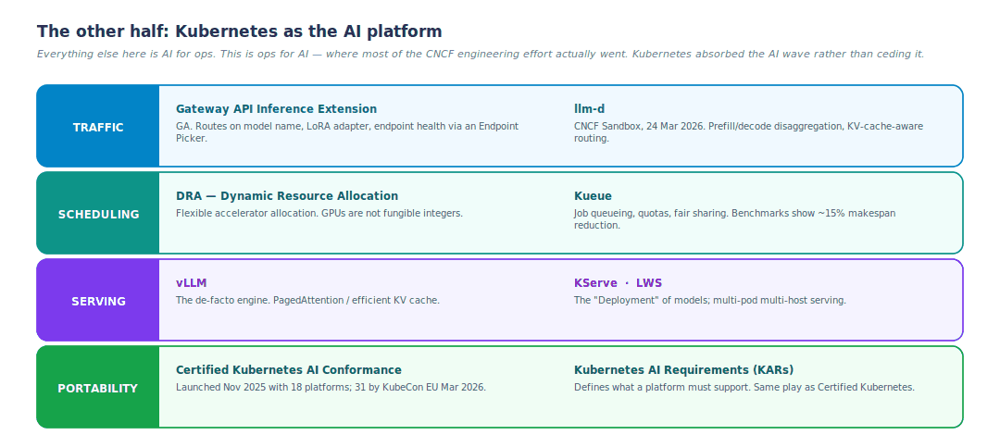

<sub>Figure 23 — Kubernetes absorbed the AI wave rather than ceding it to a separate estate.</sub>

Project links: [llm-d](https://llm-d.ai/), [vLLM](https://github.com/vllm-project/vllm), [Kueue](https://kueue.sigs.k8s.io/), [Gateway API Inference Extension](https://gateway-api-inference-extension.sigs.k8s.io/), [KServe](https://kserve.github.io/website/). The CNCF's announcement of [llm-d joining the Sandbox](https://www.cncf.io/blog/2026/03/24/welcome-llm-d-to-the-cncf-evolving-kubernetes-into-sota-ai-infrastructure/) is the best summary of where inference on Kubernetes is heading.

> **TWO NUMBERS WORTH CARRYING INTO A CONVERSATION**
>
> Benchmarks show **Kueue reducing makespan by up to 15%**, and the **Gateway API Inference Extension with llm-d improving tail latency by up to 90%** — because round-robin is simply the wrong algorithm for inference. You want to route to the pod that already holds the relevant KV cache.
>
> Kubernetes WG Serving concluded in February 2026, having done its job: its unresolved problems moved into llm-d and AIBrix, and its patterns feed the AI Conformance program. That is a healthy signal, not a retreat.

---

## 16. Buzzword decoder

Everything you are likely to hear in a KubeCon hallway or a vendor pitch, in plain English.

| Term | Plain English |
| --- | --- |
| MCP | Protocol for agent → tool. The USB-C of AI. Current spec `2026-07-28`. [modelcontextprotocol.io](https://modelcontextprotocol.io) |
| A2A | Agent2Agent. Protocol for agent → agent delegation. Google-created, Linux Foundation since June 2025, v1.0 March 2026, moved into the Agentic AI Foundation on 17 August 2026. Primitives: AgentCard served at `/.well-known/agent-card.json`, Tasks, HTTP+JSON-RPC. IBM's ACP was absorbed into it in August 2025, so there is now **one** agent-to-agent standard worth building against. [a2a-protocol.org](https://a2a-protocol.org) |
| AAIF | Agentic AI Foundation, Linux Foundation, launched December 2025. Now hosts both MCP and A2A with separate maintainers and release cadences under shared governance. |
| AGNTCY | Cisco/Outshift-originated "Internet of Agents" project, LF since July 2025: Directory, Identity, SLIM messaging, Observability. Overlaps A2A on discovery and identity — fragmentation is not fully resolved here. [agntcy.org](https://agntcy.org) |
| kagent | CNCF Sandbox. Agents as Kubernetes CRDs. [kagent.dev](https://kagent.dev) |
| kmcp | CLI plus controller for the MCP server lifecycle on Kubernetes (`MCPServer` CRD). |
| agentgateway | Rust data plane for agent traffic — MCP and A2A native. Linux Foundation project. |
| agentregistry | Proposed CNCF Sandbox registry for discovering and curating MCP servers, agents and skills — container-registry patterns applied to AI artifacts. |
| ToolHive | Containerised, policy-controlled MCP server runtime plus operator and registry, from Stacklok. |
| HolmesGPT / K8sGPT | CNCF Sandbox SRE agents. An investigation agent versus a rule-based diagnostic scanner — not the same category. |
| MRTR | Multi Round-Trip Requests. The stateless way to ask the human a question mid-tool-call. |
| CIMD | Client ID Metadata Documents. Replacing OAuth Dynamic Client Registration in MCP. |
| EMA | Enterprise-Managed Authorization. MCP extension; your IdP provisions server access centrally. |
| MCP Apps | MCP extension for server-rendered UI. UI actions travel the same JSON-RPC path, so they inherit the same audit and consent flow as tool calls. |
| Tasks | MCP extension for long-running work; poll-based `tasks/get`. Contributed by AWS. |
| Context engineering | The 2026 successor term to "prompt engineering" plus "RAG": deliberately writing, compressing, isolating and selecting what goes into the window. |
| Agentic RAG | The agent controls retrieval iteratively instead of running a one-shot pipeline. |
| GraphRAG | Retrieval over a knowledge graph instead of flat vectors. |
| Guardrails | Input/output filters — injection detection, PII redaction, topic restriction. Usually a gateway feature. |
| Evals | The test suite for non-deterministic systems. Your golden set. |
| AIBOM | AI Bill of Materials. An SBOM for models, MCP servers, skills and datasets. Becoming the expected inventory artifact. |
| Lethal trifecta | Private data + untrusted content + external communication = exfiltration risk. Break one leg. |
| OBO | On-Behalf-Of token propagation. The difference between an audit log and an audit trail. |
| SPIFFE / SVID | Workload identity standard. The right cryptographic substrate for agent identity — an A2A AgentCard can carry a SPIFFE ID. [spiffe.io](https://spiffe.io) |
| OpenFGA / Cedar / Cerbos | Externalised authorization engines. Where per-tool policy belongs. |
| KV cache / prefill / decode | Inference internals. Prefill processes the prompt (compute-bound); decode generates tokens (memory-bound). Disaggregating them onto separate GPU pools is what llm-d does. |
| Semantic caching | Cache on meaning rather than exact string match. Real money saver at a gateway. |
| Shadow AI | Ungoverned agent and MCP usage on developer machines. Usually far larger than teams realise, and nearly invisible to traditional asset inventory. |
| KAR / AI Conformance | Kubernetes AI Requirements; certification that a platform can run AI workloads portably. |

---

## 17. Your practical path from here

### 17.1  A 90-day plan

| Weeks | Theme | What you actually do |
| --- | --- | --- |
| 1–2 | Understand by building | Write a trivial MCP server (FastMCP or the MCP Go SDK), one tool<br>Connect it to Cursor over stdio — watch how much the tool description matters<br>Run `k8sgpt analyze --explain` against a broken namespace<br>Read the MCP 2026-07-28 changelog end to end |
| 3–6 | Make it cloud-native | `kmcp init / build / deploy` — get your server into a cluster as an MCPServer<br>Give it a read-only ServiceAccount and a NetworkPolicy; prove it cannot escape<br>Deploy HolmesGPT in read-only mode against staging<br>**Write ONE runbook with a Meta header and exclusion rules. Measure wasted calls before and after.** This is the experiment that will convince your team. |
| 7–10 | Govern it | Stand up a gateway — LiteLLM for speed, or Envoy AI Gateway / agentgateway if you are already on the Gateway API<br>Wire OIDC; get per-user attribution end to end and verify it in the audit log<br>Instrument with OTel GenAI conventions; build the cost and wasted-call dashboard<br>Write the content-capture policy BEFORE turning content capture on |
| 11–13 | Prove value | Build a golden set of 20 past incidents from your own postmortems<br>Run the agent against them nightly in CI; track accuracy and cost<br>Wire alert → enrich → dedupe (workload level) → investigate → Slack thread<br>Publish the numbers: minutes saved, % auto-resolved, $ per investigation |

### 17.2  Seven judgements worth internalising

1. **Runbooks beat models.** Measured, repeatedly. Spend your time on context, not on model shopping.
2. **Exclusion rules beat instructions.** Telling the agent what *not* to do narrows the search space more cheaply than telling it what to do.
3. **Most "agent" problems are workflow problems.** If you know the steps, write the steps.
4. **Read-only is where the value is.** Rungs 2–3 of the maturity ladder deliver most of the benefit at a fraction of the risk.
5. **All security lives outside the model.** Never in the prompt. Identity, RBAC, sandbox, egress, approval.
6. **Design for model migration from day one.** One config block. The pipeline is the stable core; the model is the replaceable part.
7. **The glue is real engineering.** Dedup, routing, threading, budgets, retries. Budget for it — it is typically more code than the "AI" part.

### 17.3  What to watch over the next six months

- **KubeCon + CloudNativeCon NA 2026** — Salt Lake City, 9–12 November. Expect agentic AI and AI conformance to dominate the schedule.
- kagent's path toward CNCF Incubation, and whether agentregistry lands in Sandbox.
- Whether any `gen_ai.*` OTel attribute reaches Stable, and the first tagged release of `semantic-conventions-genai`.
- The OWASP MCP Top 10 next release — October 2026 cycle.
- The agentgateway ↔ Envoy AI Gateway ↔ kgateway convergence settling into one recommended path.
- NIST's AI Agent Standards Initiative (began February 2026), and EU AI Act / ISO 42001 obligations reaching agent behaviour and credential controls.

> **TWO THINGS I WOULD DO FIRST, IN YOUR ENVIRONMENT SPECIFICALLY**
>
> **A custom MCP server** exposing `get_flux_reconcile_status` and `get_longhorn_volume_health` will beat a generic kubectl MCP server by a wide margin, because it encodes what your platform actually means rather than what Kubernetes generically exposes.
>
> **The runbook experiment in Section 9** is cheap enough to run in a week and produces a number — wasted calls before and after — that makes the case to your team far better than any article will.

---

## 18. Sources

Everything in this guide is traceable to one of these. Where a claim is version-specific, verify it against the project docs before committing to an architecture — this ecosystem moves fast.

#### Specifications and standards

- [The 2026-07-28 MCP Specification](https://blog.modelcontextprotocol.io/posts/2026-07-28/) — the release announcement, with the full rationale
- [MCP Authorization spec, 2026-07-28](https://modelcontextprotocol.io/specification/2026-07-28/basic/authorization)
- [MCP full changelog](https://modelcontextprotocol.io/specification/2026-07-28/changelog)
- [Agent Skills open standard](https://agentskills.io)
- [A2A Protocol](https://a2a-protocol.org) · [Linux Foundation A2A announcement](https://www.linuxfoundation.org/press/linux-foundation-launches-the-agent2agent-protocol-project-to-enable-secure-intelligent-communication-between-ai-agents)
- [Diving into the MCP authorization specification](https://www.descope.com/blog/post/mcp-auth-spec) — Descope

#### CNCF and project sources

- [Auto-diagnosing Kubernetes alerts with HolmesGPT and CNCF tools](https://www.cncf.io/blog/2026/04/21/auto-diagnosing-kubernetes-alerts-with-holmesgpt-and-cncf-tools/) — the STCLab runbook study, the single most useful article here
- [Kagent: Bringing Agentic AI to Cloud Native](https://www.cncf.io/blog/2025/04/15/kagent-bringing-agentic-ai-to-cloud-native/)
- [Welcome llm-d to the CNCF](https://www.cncf.io/blog/2026/03/24/welcome-llm-d-to-the-cncf-evolving-kubernetes-into-sota-ai-infrastructure/)
- [Kubernetes WG Serving concludes](https://www.cncf.io/blog/2026/02/26/kubernetes-wg-serving-concludes-following-successful-advancement-of-ai-inference-support/)
- [The platform under the model](https://www.cncf.io/blog/2026/03/26/the-platform-under-the-model-how-cloud-native-powers-ai-engineering-in-production/)
- [kagent / kmcp deploy docs](https://kagent.dev/docs/kmcp/deploy/server/)
- [HolmesGPT on GitHub](https://github.com/robusta-dev/holmesgpt) · [K8sGPT](https://github.com/k8sgpt-ai/k8sgpt)
- [agentregistry CNCF Sandbox proposal](https://github.com/cncf/sandbox/issues/477)

#### Security

- [OWASP MCP Top 10](https://owasp.org/www-project-mcp-top-10/) · [OWASP GenAI Security Project](https://genai.owasp.org/)
- [Securing AI agents: when AI tools move from reading to acting](https://www.microsoft.com/en-us/security/blog/2026/06/30/securing-ai-agents-ai-tools-move-from-reading-acting/) — Microsoft Security
- [Agentic MCP Security Best Practices](https://labs.cloudsecurityalliance.org/agentic/agentic-mcp-security-best-practices-v1/) — Cloud Security Alliance
- [The Enterprise IT Security Guide to Claude + MCP](https://stacklok.com/blog/the-enterprise-it-security-guide-to-claude-and-mcp/) — Stacklok
- [ToolHive: running any MCP server securely](https://www.helpnetsecurity.com/2026/09/07/toolhive-open-source-mcp-server-security/) — Help Net Security

#### Observability

- [How OpenTelemetry traces LLM calls, agent reasoning and MCP tools](https://greptime.com/blogs/2026-05-09-opentelemetry-genai-semantic-conventions) — Greptime
- [OpenTelemetry GenAI Semantic Conventions explained](https://www.dash0.com/knowledge/opentelemetry-genai-semantic-conventions-explained) — Dash0
- [semantic-conventions-genai repository](https://github.com/open-telemetry/semantic-conventions-genai)

#### Gateways and platform

- [The AI Gateway Landscape](https://liquidreply.net/en/news/the-ai-gateway-landscape-agentgateway-litellm-kong-and-envoy-ai-gateway) — Liquid Reply
- [Enterprise MCP Gateway Guide](https://www.snowflake.com/en/blog/engineering/enterprise-mcp-gateway-ai-agent-governance/) — Snowflake
- [agentgateway](https://agentgateway.dev/) · [Envoy AI Gateway](https://aigateway.envoyproxy.io/) · [ToolHive](https://github.com/stacklok/toolhive)
- [Kubernetes MCP server: AI-powered cluster management](https://developers.redhat.com/articles/2025/09/25/kubernetes-mcp-server-ai-powered-cluster-management) — Red Hat Developer

#### Retrieval

- [Introducing contextual retrieval](https://www.anthropic.com/engineering/contextual-retrieval) — Anthropic
- [ReAct: Synergizing Reasoning and Acting in Language Models](https://arxiv.org/abs/2210.03629) — the original agent-loop paper

---

*Compiled 27 September 2026. Diagrams authored for this document. Where a figure cites a statistic, the source is named in the caption or the surrounding text.*
